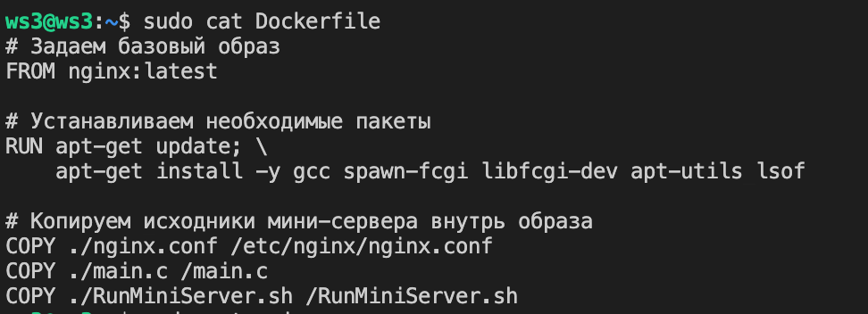
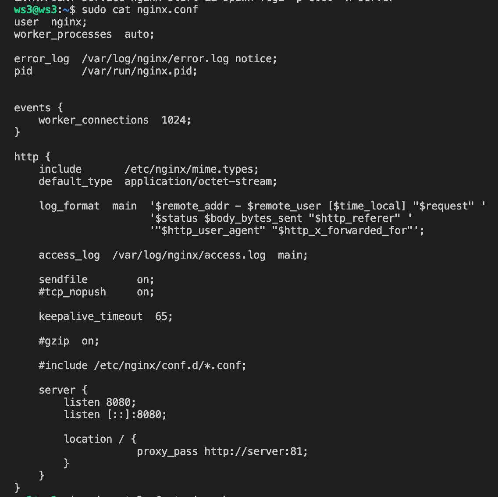

## Отчет по заданию "Simple Docker":

1) [Готовый докер](#part-1-готовый-докер)
2) [Операции с контейнером](#part-2-операции-с-контейнером)
3) [Мини веб-сервер](#part-3-мини-веб-сервер)
4) [Собственный докер](#part-4-собственный-докер)
5) [Команда "dockle"](#part-5-докль)
6) [Базовая компоновка Docker](#part-6-базовая-компоновка-docker)

## Part 1. Готовый докер.

1. Возьмите официальный образ докера из nginx и загрузите его с помощью docker pull:

\-
`sudo apt install docker.io`

    Docker.io является официальным пакетом Docker для Ubuntu и Debian. 
    Он содержит всенеобходимые компоненты Docker, включая демона Docker, клиентскую утилиту и другие зависимости. 
    Эта команда устанавливает пакет Docker.io из репозитория Ubuntu. docker.io - это фактическое имя пакета Docker в репозитории Ubuntu, и именно это нужно указывать при установке Docker на Ubuntu, чтобы избежать конфликтов с другими пакетами, имеющими название "docker".
    
\-
`docker pull nginx`

    Во время выполнения команды "docker pull", Docker создает HTTP-запрос на сервер Docker Hub, авторизуется с вашими учетными данными (если они требуются) и скачивает образ. 
    NGINX - это программное обеспечение, которое работает на сервере и используется в качестве веб-сервера. 
    Оно служит для обработки веб-запросов, маршрутизации трафика и обеспечения высокой производительности и масштабируемости веб-приложений.
    
\-
`sudo docker images`

    Команда sudo docker images используется для вывода списка всех доступных образов Docker, которые находятся на вашей системе. 
    Когда вы выполняете эту команду, Docker CLI обращается к Docker-демону и запрашивает список образов на вашей машине.
    
    REPOSITORY: репозиторий (имя образа);
    TAG: тег, связанный с образом. Каждый образ может иметь несколько тегов, позволяя вам иметь различные варианты этого образа;
    IMAGE ID: уникальный идентификатор образа;
    CREATED: дата создания образа;
    SIZE: размер образа в байтах.

3. Запустите образ докера с помощью docker run -d [image_id|repository]:

    Команда "docker run" используется для создания и запуска нового контейнера из указанного образа Docker.
    Опция "-d" указывает Docker на запуск контейнера в фоновом режиме (daemon mode).
    [image_id|repository] представляет собой идентификатор образа Docker или репозитория, из которого будет создан контейнер.
    
\-
`docker run -d 89da1fb6dcb9`

     0facb48e92b26651a11757aacb8f65609609d3121f7ad453a53d36fe542bd0db - представляет собой идентификатор (ID) запущенного контейнера. 

4. Просмотр информации о контейнере с помощью docker inspect [container_id|container_name]:
     
\-
`sudo docker inspect 0facb48e92b26651a11757aacb8f65609609d3121f7ad453a53d36fe542bd0db`

    Id: уникальный идентификатор контейнера или образа Docker.
    Name: имя контейнера, присвоенное при создании.
    State: состояние контейнера (например, запущен, остановлен, выключен).
    Image: имя или идентификатор базового образа, на основе которого создан контейнер.
    Mounts: список привязанных томов или файловых систем, доступных в контейнере.
    Networks: список сетей, к которым подключен контейнер.
    Config: конфигурация контейнера, включая команду запуска, переменные среды, проброс портов и другие настройки.
    Created: время создания контейнера или образа.
    NetworkSettings: настройки сети контейнера, такие как IP-адрес, порт проброса и другие сведения о сети.

5. Из вывода команды определите и напишите в отчете размер контейнера, список сопоставленных портов и IP-адрес контейнера:

    "Ports": {"80/tcp": null} -  означает, что контейнер имеет открытый порт 80. Опция "null" указывает, что данное поле не содержит дополнительной информации о конфигурации порта, такой как привязка порта на хостовой машине или использование протокола.
    
    "IPAddress": "172.17.0.2" - указывает на IP-адрес контейнера
    
    "ShmSize": 67108864 - означает размер разделяемой памяти (Shared Memory) контейнера в байтах.

6. Остановить образ докера с помощью docker stop [container_id|container_name]:

\-
`sudo docker stop 4db0c07cacea`

7. Запустите докер с портами 80 и 443 в контейнере, сопоставленными с теми же портами на локальном компьютере, с помощью команды запуска:

\-
`sudo docker run -d -p 80:80 -p 443:443 <имя_образа>`

    -p 80:80 указывает на сопоставление порта 80 контейнера с портом 80 на локальном компьютере.
    -p 443:443 указывает на сопоставление порта 443 контейнера с портом 443 на локальном компьютере.
    <имя_образа> - имя Docker образа, который вы хотите запустить.

8. Убедитесь, что стартовая страница nginx доступна в браузере по адресу localhost:80.

\-
`curl localhost:80`

9. Перезапустите контейнер докеров с помощьюdocker restart [container_id|container_name] и проверьте любым способом,  что контейнер запущен:

\-
`sudo docker restart 6e87b840ee79acb3058b85bf2f54c7389b4d8dd67783e681d6ca0dc7b26c7f90`

\-
`sudo docker ps`

## Part 2. Операции с контейнером.

1. Прочитайте файл конфигурации nginx.conf внутри контейнера докеров с помощью команды exec:

\-
`docker exec <container_id> cat <path_to_file>`

\-
`sudo docker exec 5a5f381848ab cat /etc/nginx/nginx.conf`

     Файл /etc/nginx/nginx.conf - это конфигурационный файл для веб-сервера Nginx. В этом файле определяются настройки и параметры работы сервера, такие как порт, домены, логирование, правила маршрутизации и другие опции. Изменение этого файла позволяет настроить поведение Nginx в зависимости от конкретных требований и потребностей вашего веб-приложения или сайта.
     
2. Создайте файл nginx.conf на локальном компьютере:

\-
`sudo docker exec -it  5a5f381848ab  cat /etc/nginx/nginx.conf > part2/nginx.conf`

    sudo - выполняет команду от имени суперпользователя (root).
    docker exec -it 6e87b840ee79 - запускает команду внутри контейнера с идентификатором 6e87b840ee79.
    cat /etc/nginx/nginx.conf - выводит содержимое файла /etc/nginx/nginx.conf изнутри контейнера.
    > - перенаправляет вывод команды в файл.    
    part2/nginx.conf - указывает путь и имя файла, куда будет сохранено содержимое файла /etc/nginx/nginx.conf из контейнера.

3. Настройте его на пути /status , чтобы вернуть страницу состояния сервера nginx:

\-
`sudo nano nginx.conf`

location /status {
    stub_status;
}

    uuser nginx;: Устанавливает пользователя, от имени которого будет работать nginx сервер. В данном случае, пользователь - nginx.
    worker_processes auto;: Указывает количество процессов-работников для обработки запросов. Значение auto говорит о том, что количество процессов будет определено автоматически в зависимости от доступных ресурсов.
    error_log /var/log/nginx/error.log notice;: Устанавливает путь к файлу, в котором будет записываться журнал ошибок nginx сервера с указанным уровнем важности (notice).
    pid /var/run/nginx.pid;: Устанавливает путь к файлу, в котором будет записан идентификатор процесса (PID) nginx сервера.
    events {...}: Определяет настройки для событий, связанных с обработкой запросов. В данном случае, устанавливается максимальное количество одновременных соединений (worker_connections) в 1024.
    http {...}: Определяет настройки HTTP протокола.
    include /etc/nginx/mime.types;: Включает файл с определением типов данных MIME для nginx сервера.
    default_type application/octet-stream;: Устанавливает значение типа по умолчанию для ответов сервера, если тип не был определен.
    log_format main ...;: Определяет формат записи в журналах доступа (main) для nginx сервера.
    access_log /var/log/nginx/access.log main;: Устанавливает путь к файлу, в котором будет записываться журнал доступа nginx сервера с заданным форматом (main).
    sendfile on;: Включает использование системного вызова sendfile для копирования файловых данных с диска на сетевую карту.
    keepalive_timeout 65;: Устанавливает значение таймаута соединения keep-alive для клиентов, которые используют keep-alive соединения.
    server {...}: Определяет настройки для конкретного сервера.
    listen 80;: Задает порт (80) для прослушивания входящих HTTP запросов.
    location /status {...}: Определяет настройки для конкретного URL маршрута "status
    
4. Скопируйте созданный файл nginx.conf внутрь образа докера с помощью docker cpкоманды:

\-
`sudo docker cp nginx.conf  5a5f381848ab:/etc/nginx/nginx.conf`

5. Перезапустите nginx внутри образа докера с помощью exec:

\-
`sudo docker exec -it 5a5f381848ab nginx -s reload`

6. Убедитесь, что localhost:80/status возвращает страницу состояния сервера nginx:

\-
`curl localhost:80/status`

7. Экспортируйте контейнер в файл container.tar с помощью команды экспорта:

\-
`sudo docker export 5a5f381848ab > container.tar`

8. Остановить контейнер:

\-
`sudo docker stop 5a5f381848ab`

9. Удалить изображение с помощью, docker rmi [image_id|repository]не удаляя сначала контейнер:

\-
`sudo docker rmi 5a5f381848ab`

    Команда "sudo docker rmi nginx" используется для удаления образа Docker с именем "nginx" из вашего локального репозитория образов Docker.
    
10. Удалить остановленный контейнер:

\-
`docker container rm 5a5f381848ab`

11. Импортируйте контейнер обратно с помощью команды import:

\-
`sudo docker import -c 'CMD ["nginx", "-g", "daemon off;"]' container.tar`

    Команда sudo docker import используется для создания нового Docker-образа из файла с архивом контейнера, container.tar. При выполнении указанной команды, Docker будет импортировать данные из container.tar и создаст новый образ, используя заданную конфигурацию. Этот образ можно будет использовать для создания и запуска новых контейнеров, которые будут содержать установленный Nginx с указанными параметрами запуска.
    
12. Запустите импортированный контейнер:

\-
`sudo docker run -d -p 80:80 -p 443:443 696ffca78ec8 `

13. Убедитесь, что localhost:80/status возвращает страницу состояния сервера nginx:

\-
`curl localhost:80/status`

## Part 3. Мини веб-сервер.

1. Напишите мини-сервер на C и FastCgi , который будет возвращать простую страницу с текстом Hello World!:

    Необходимо установить бибилотеку #include <fcgi_stdio.h>
\-
`sudo apt-get install libfcgi-dev`

    FCGI (FastCGI) - это протокол, который позволяет веб-серверу передавать запросы и получать ответы от приложений в формате CGI (Common Gateway Interface) более эффективно и быстро.
    Библиотека fcgi_stdio.h предоставляет функции и макросы для чтения и записи информации через FastCGI ввод/вывод веб-сервера. Она позволяет разрабатывать веб-приложения, которые могут принимать и обрабатывать запросы от веб-сервера, основываясь на FastCGI протоколе.

    printf("Content-Type: text/html\r\n\r\n"); - выводит заголовок HTTP-ответа, указывающий тип содержимого как text/html.
    
    printf("...Hello World!..."); - выводит HTML-код с приветствием Hello World!.

    Флаг -lfcgi говорит компилятору, что нужно использовать библиотеку libfcgi при компиляции.

2. Запустите написанный мини-сервер через spawn-fcgi на порту 8080:

    Для звпуска мини-сервера пишем скрипт. Отправляем его на машину и применяем.
\-
`sudo docker exec 4be58c1e4bea bash run.sh`

3. Напишите свой собственный nginx.conf , который будет проксировать все запросы с порта 81 на 127.0.0.1:8080.:

4. Убедитесь, что браузер на localhost:81 возвращает страницу, которую вы написали:
    
\-
`sudo docker exec -it 4be58c1e4bea  curl localhost:81`

5. Поместите файл nginx.conf в папку ./nginx/nginx.conf (он понадобится вам позже):

## Part 4. Собственный докер.

    Образ Docker – это запускаемая единица, которая содержит все, что необходимо для выполнения приложения в изолированном окружении. Он включает в себя операционную систему, библиотеки, приложение и его зависимости.
    Для создания образа Docker необходим Dockerfile – текстовый файл, в котором описываются инструкции по установке и настройке необходимых компонентов. 
    
1. Напишите свой собственный образ докера, который:
    
    1) собирает исходники мини-сервера на FastCgi из [Мини веб-сервер](#part-3-мини-веб-сервер)
    2) запускает его на порту 8080
    3) копирует внутрь образа прописанный ./nginx/nginx.conf
    4) запускает nginx .
    
Мой образ докера собирается с RunMiniServer.sh, который и выполняет основные действия из задания. Он описан позже.

6. Добавьте проксирование страницы /status в ./nginx/nginx.conf для возврата статуса сервера nginx:
    

2. Соберите написанный образ докера с помощью docker build, указав имя и тег:

4. Запустите созданный образ докера, сопоставив порты 81 и 80 на локальном компьютере и сопоставив папку ./nginx внутри контейнера с адресом, где расположены файлы конфигурации nginx (см. часть 2 ):

5. Проверяем, что страница написанного мини-сервера доступна на localhost:80:

Пишем 3 скрипта: RunMiniServer.sh, RunContainer.sh, StopContainer.sh.

Эти скрипты выполняют следующие действия:

    RunMiniServer.sh: запускает мини-сервер на хостовой машине. Сначала компилируется файл main.c с использованием библиотеки libfcgi. 
    Затем мы проверяем, какие процессы идут на порту 8080. После чего запускается процесс spawn-fcgi с опцией -p 8080 для привязки процесса мини сервера из part3 (./a.out) к порту 8080. 
    Далее запускается Nginx для передачи запроса к запущенному CGI-процессу. И после всех выполненных команд мы снова проверяем, какие процессы идут на порту 8080,чтобы проверить, привязался ли наш процесс.
    
    RunContainer.sh: собирает контейнер на основе образа rhogoron:1.0, запускает контейнер в фоновом режиме с пробросом порта 80 на порт 81 контейнера, и затем выполняет скрипт RunMiniServer.sh внутри контейнера.
    После чего мы задерживаем выполнение скрипта на 1 секунду, чтобы дать контейнеру время запуститься и инициализироваться. 
    Далее мы выполняем запросы на сайт для того, чтобы проверить, пробросились ли наши порты верно.
    
    StopContainer.sh: останавливает и удаляет контейнер с именем container-server, а затем удаляет образ rhogoron:1.0.

Зпускаем скрипт RunContanier.sh:

\-
`sudo sh RunContanier.sh`

    С помощью вывода мы можем увидеть, что процесс появился на порту 80 (spawn-fcgi -p 8080 ./a.out). Так же проброс портов тоже проходит верно, так как сайт вернул нам вывод. И так же проверяем процесс на порту 80/status
    

3. Проверяем, docker images что все построено правильно:

7. Перезапустите образ докера:
8. Убедитесь, что localhost:80/status теперь возвращает страницу со статусом nginx:

    *Если все сделано правильно, то после сохранения файла и перезапуска контейнера конфигурационный файл внутри docker-образа должен сам обновиться без каких-либо дополнительных действий

\-
`sudo docker restart <container_id>`

Останавлеваем все процессы:

\-
`sudo sh StopContanier.sh`

## Part 5. Докль.

    Команда "dockle" является инструментом для проверки безопасности образов Docker. Ей можно передать идентификатор образа или название репозитория.
    При выполнении команды "dockle [image_id|repository]" инструмент сканирует Docker-образ и проводит анализ его содержимого в соответствии с набором предустановленных правил. Dockle проверяет такие аспекты безопасности, как уязвимости в операционной системе, наличие паролей и ключей, проблемы с правами доступа, использование устаревших компонентов и другие потенциальные проблемы.

Скачиваем dockle:

\-
`VERSION=$(curl --silent "https://api.github.com/repos/goodwithtech/dockle/releases/latest" | \grep '"tag_name":' | \sed -E 's/.*"v([^"]+)".*/\1/' \)`

\-
`curl -L -o dockle.deb https://github.com/goodwithtech/dockle/releases/download/v${VERSION}/dockle_${VERSION}_Linux-64bit.deb `

\-
`sudo dpkg -i dockle.deb && rm dockle.deb`

1. Проверьте изображение из предыдущей задачи с помощью dockle [image_id|repository]:
2. Исправьте образ, чтобы не было ошибок или предупреждений при проверке с помощью докла:

    FROM ubuntu:20.04 создаем другой образ, чтобы исправить первую ошибку. Так же позже добавляем установку nginx. (apt-get install -y nginx gcc spawn-fcgi libfcgi-dev;\)
    RUN useradd rhogoron создаем новоого пользователя.
    rm -rf /var/lib/apt/lists удаляем содержимое директории, чтобы  удалить временные файлы и сократить размер образа Docker.
    USER rhogoron переключаемся на нового пользователя.
    
\-
`sudo docker build -t rhogoron:20.04 .`

\-
`sudo dockle rhogoron:20.04`

## Part 6. Базовая компоновка Docker.

1. Напишите файл docker-compose.yml , используя который:

    1) Запустите докер-контейнер из части 5 (он должен работать в локальной сети, т.е. вам не нужно использовать инструкцию EXPOSE и сопоставлять порты с локальной машиной)
    2) Запустите контейнер докеров с помощью nginx , который будет проксировать все запросы с порта 8080 на порт 81 первого контейнера.
    
    
2. Сопоставьте порт 8080 второго контейнера с портом 80 локальной машины.
3. Остановить все запущенные контейнеры
4. Создайте и запустите проект с помощью команд docker-compose buildиdocker-compose up
5. Убедитесь, что браузер возвращает страницу, которую вы написали на localhost: 80 , как и раньше

Файлы:

    docker-compose.yml  Dockerfile nginx.conf  RunContanier.sh  server  StopContanier.sh
   

    Файл Dockerfile cодержит инструкции, которые описывают шаги, необходимые для сборки образа контейнера.
    Устанавливается базовый образ nginx:latest.
    Создается новый пользователь rhogoron.
    Копируются файлы nginx.conf и main.c из локальной директории ./server в соответствующие директории внутри контейнера.
    Обновляется список пакетов и устанавливаются пакеты nginx, gcc, spawn-fcgi и libfcgi-dev.
    Удаляются временные файлы пакетов после установки.
    Компилируется main.c файл с использованием библиотеки fcgi и создается исполняемый файл server.
    При запуске контейнера выполняется команда service nginx start для запуска Nginx сервера и команда spawn-fcgi -p 8080 -n server для запуска FastCGI сервера server на порту 8080.
    

    Файл docker-compose.yml содержит описание сервисов, которые будут запущены в контейнерах.
    В разделе services описываются два сервиса:
    Сервис "server" использует образ с именем "rhogoron:1.0" и строится из текущей директории (build: .). Также, ему присваивается имя контейнера "OneContainer".
    Сервис "proxy" использует образ "nginx" и также имеет имя контейнера "TwoContainer". Он монтирует настройки для Nginx из файла "nginx.conf" в контейнере, находящемся в текущей директории (volumes: - ./nginx.conf:/etc/nginx/nginx.conf). Кроме того, он проксирует порт 80 на порт 8080 в контейнере (ports: - 80:8080).

    Файл nginx.conf настраивает сервер Nginx. server - задает сервер на порту 8080 и на [::]:8080, что означает, что сервер будет слушать запросы как на IPv4-адресе, так и на IPv6-адресе.
    Внутри блока location / настроена прокси-пересылка (proxy_pass) всех запросов, полученных на этот сервер, на другой сервер, который работает на порту 81 с именем "server".

\-
`docker-compose build`
    
    Эта команда собирает Docker-образы для всех сервисов, определенных в файле docker-compose.yml. 
    Она создает новые образы или обновляет существующие на основе Dockerfile, указанных для каждого сервиса.

\-
`docker-compose up -d`

     Эта команда запускает контейнеры всех сервисов, определенных в файле docker-compose.yml, в фоновом режиме (-d означает "detach mode"). Контейнеры будут запущены на основе собранных ранее образов.

    main.c  nginx.conf

    Первый блок server слушает порт 80 и обрабатывает все запросы, направляя их на сервер, который слушает порт 8080 с использованием протокола FastCGI. 
    То есть, все запросы, попадающие на порт 80, будут проксироваться на сервер, работающий на порту 8080. 
    Также в первом блоке определена директива "location /status", которая позволяет получить статус сервера в формате статусной строки HTTP.

    Второй блок server слушает порт 81 и также обрабатывает все запросы, но вместо того, чтобы обрабатывать их самостоятельно, он проксирует запросы на сервер, работающий на порту 80 с использованием протокола HTTP. 
    То есть, все запросы, попадающие на порт 81, будут проксироваться на сервер, работающий на порту 80.

    Таким образом, данный конфигурационный файл позволяет установить прокси-сервер Nginx, который будет принимать запросы на порту 81 и проксировать их на сервер, который слушает порт 80 с использованием протоколов HTTP и FastCGI.

